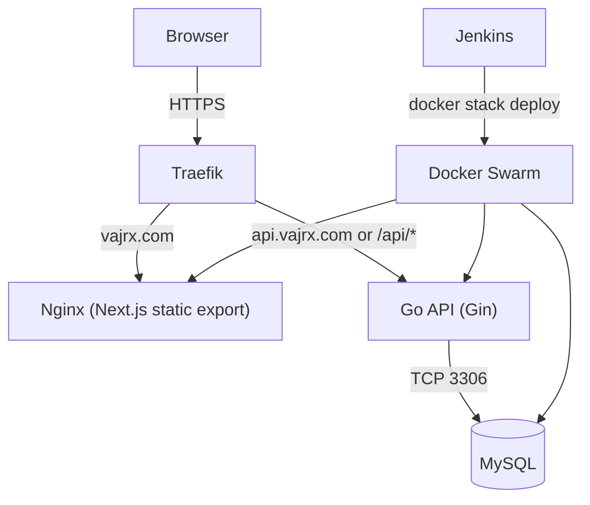

# Design Document: VajraX Website

## Overview

VajraX (vajrx.com) is a startup website for a defence/electronics/medical engineering company. The site serves as the public face of the company — showcasing projects, team, and services — while also capturing inbound leads via contact and idea submission forms. An internal admin panel lets the team review submissions.

The system is split into two deployable units:

- **Frontend**: Next.js 14 (TypeScript) with Tailwind CSS and Framer Motion, served via Nginx
- **Backend**: Golang REST API (Gin framework) backed by MySQL

Both are containerised and deployed via Docker Swarm, with Traefik handling HTTPS routing and Jenkins managing CI/CD.

### Design Goals

- Cinematic, dark-matte aesthetic that communicates credibility and technical depth
- Fast, statically-rendered pages for public content (projects, about, services)
- Reliable form submission pipeline with clear user feedback
- Minimal, auditable admin panel with no public exposure of submission data
- Infrastructure that can be maintained by a small team

---

## Architecture



### Monorepo Layout

```
/
├── frontend/               # Next.js 14 app
│   ├── app/                # App Router pages
│   ├── components/         # Shared UI components
│   ├── data/               # Static project data (TypeScript constants)
│   ├── lib/                # API client, utilities
│   └── public/             # Static assets (team SVGs, etc.)
├── backend/                # Go API
│   ├── cmd/server/         # Entry point
│   ├── internal/
│   │   ├── handlers/       # HTTP handlers
│   │   ├── middleware/      # Auth middleware
│   │   ├── models/         # DB models
│   │   └── db/             # MySQL connection + migrations
│   └── Dockerfile
├── docker-compose.yml      # Local dev
├── docker-stack.yml        # Production Swarm stack
├── Jenkinsfile
└── nginx.conf
```

### Request Flow

1. All traffic enters via Traefik (TLS termination, routing by hostname/path)
2. Frontend static assets served by Nginx (Next.js static export or SSR container)
3. API calls from the browser hit the Go backend directly via `/api/*` path prefix
4. Go API reads/writes MySQL; no direct DB access from the frontend
5. Admin panel authenticates via a JWT issued by the Go API; token stored in `sessionStorage`

---

## Components and Interfaces

### Frontend Pages

| Route | Component | Rendering |
|---|---|---|
| `/` | `HomePage` | SSG |
| `/about` | `AboutPage` | SSG |
| `/projects` | `ProjectsPage` | SSG |
| `/projects/[slug]` | `ProjectDetailPage` | SSG (generateStaticParams) |
| `/services` | `ServicesPage` | SSG |
| `/submit-idea` | `SubmitIdeaPage` | CSR (form) |
| `/contact` | `ContactPage` | CSR (form) |
| `/secret-admin` | `AdminPage` | CSR (protected) |

All public pages use Next.js static generation. Form pages and the admin panel are client-rendered.

### Frontend Component Structure (Atomic Design)

```
components/
├── atoms/                        # Smallest indivisible UI units
│   ├── Button.tsx                # CTA / submit / nav buttons
│   ├── Badge.tsx                 # Domain tag pill (Electronics / Defence / Medical)
│   ├── StatusBadge.tsx           # "Completed" / "In Progress" pill
│   ├── Input.tsx                 # Single text/email/tel input
│   ├── Textarea.tsx              # Multi-line input
│   ├── Label.tsx                 # Form field label
│   ├── ErrorMessage.tsx          # Inline validation error text
│   ├── SectionTitle.tsx          # Reusable section heading
│   └── Logo.tsx                  # VajrX wordmark / logo
│
├── molecules/                    # Composed from atoms
│   ├── FormField.tsx             # Label + Input/Textarea + ErrorMessage
│   ├── NavLink.tsx               # Single nav item with active state
│   ├── ProjectCard.tsx           # Card: title + domain badge + status + hover
│   ├── DomainCard.tsx            # Electronics / Defence / Medical card
│   ├── TeamMemberCard.tsx        # Avatar + name + title + bio
│   ├── CredibilityItem.tsx       # Single partner/org badge
│   └── AnimatedCard.tsx          # Framer Motion hover wrapper
│
├── organisms/                    # Complex sections composed from molecules
│   ├── Navbar.tsx                # Full navigation bar
│   ├── Footer.tsx                # Site footer
│   ├── HeroSection.tsx           # Full-viewport hero with tagline + CTA
│   ├── DomainsSection.tsx        # Three DomainCards in a row
│   ├── FeaturedProjects.tsx      # Curated project grid on Home
│   ├── CredibilityBanner.tsx     # Partner logos / org names strip
│   ├── ProjectsGrid.tsx          # Full projects listing grid
│   ├── TeamSection.tsx           # Team member cards layout
│   ├── ContactForm.tsx           # Full contact form organism
│   ├── IdeaForm.tsx              # Full idea submission form organism
│   ├── AdminLogin.tsx            # Password gate for admin panel
│   └── SubmissionsTable.tsx      # Admin data table (contacts or ideas)
│
├── templates/                    # Page-level layout shells
│   ├── PageLayout.tsx            # Navbar + children + Footer wrapper
│   └── AdminLayout.tsx           # Admin-specific layout (no public nav)
│
└── pages (app/ router)           # Next.js App Router — assemble templates + organisms
    ├── page.tsx                  # /  (Home)
    ├── about/page.tsx
    ├── projects/page.tsx
    ├── projects/[slug]/page.tsx
    ├── services/page.tsx
    ├── submit-idea/page.tsx
    ├── contact/page.tsx
    └── secret-admin/page.tsx
```

### Framer Motion Animation Conventions

All interactive cards use a shared `AnimatedCard` wrapper:

```tsx
// components/ui/AnimatedCard.tsx
const AnimatedCard = ({ children }: { children: React.ReactNode }) => (
  <motion.div
    whileHover={{ scale: 1.03, boxShadow: "0 0 24px rgba(59,130,246,0.3)" }}
    transition={{ type: "spring", stiffness: 300, damping: 20 }}
  >
    {children}
  </motion.div>
);
```

Page transitions use `AnimatePresence` with a fade-slide pattern at the layout level.

### Backend API Handlers

```
internal/handlers/
├── contact.go      # POST /api/contact
├── idea.go         # POST /api/idea
└── admin.go        # GET /api/admin/contacts, GET /api/admin/ideas
                    # POST /api/admin/login  (issues JWT)
```

### Middleware

```
internal/middleware/
└── auth.go         # Validates Bearer JWT on /api/admin/* routes
```

JWT is signed with `ADMIN_JWT_SECRET` env var. The `/api/admin/login` endpoint accepts the `ADMIN_PASSWORD` and returns a short-lived JWT (24h). This avoids sending the raw password on every admin API call.

### Go API Interface (Gin routes)

```go
r := gin.Default()
api := r.Group("/api")
{
    api.POST("/contact", handlers.PostContact)
    api.POST("/idea",    handlers.PostIdea)

    admin := api.Group("/admin")
    admin.POST("/login", handlers.AdminLogin)
    admin.Use(middleware.RequireAuth())
    {
        admin.GET("/contacts", handlers.GetContacts)
        admin.GET("/ideas",    handlers.GetIdeas)
    }
}
```

---

## Data Models

### Static Frontend Data (TypeScript)

Projects are stored as typed constants — no database involvement.

```typescript
// data/projects.ts
export type ProjectStatus = "Completed" | "In Progress";
export type ProjectDomain = "Electronics" | "Defence" | "Medical";

export interface Project {
  slug: string;
  title: string;
  domains: ProjectDomain[];
  status: ProjectStatus;
  shortDescription: string;
  fullDescription: string;
  techStack?: string[];
  highlights?: string[];
  futureGoals?: string[];
}

export const PROJECTS: Project[] = [
  {
    slug: "lightning-detection-system",
    title: "Real-Time Lightning Detection & Cloud Logging System",
    domains: ["Electronics", "Defence"],
    status: "Completed",
    shortDescription: "AS3935-based lightning detector with STM32 and cloud logging.",
    fullDescription: "...",
    techStack: ["AS3935", "STM32 Nucleo-F302R8", "Python", "SQLite", "Google Sheets"],
    highlights: [
      "Custom ferrite rod antenna tuned to 500kHz",
      "RC notch filter for RF interference rejection",
      "Python backend logging to SQLite and Google Sheets",
    ],
    futureGoals: ["NavIC integration for precise strike geolocation"],
  },
  {
    slug: "airway-assessment-ml",
    title: "AI-Based Difficult Airway Assessment ML Model",
    domains: ["Medical"],
    status: "In Progress",
    shortDescription: "ML model for pre-intubation airway assessment.",
    fullDescription: "...",
    highlights: [
      "Standardisation of pre-intubation scoring for anesthesiologists",
      "Reduction of human error in difficult airway prediction",
    ],
  },
];
```

### MySQL Schema

```sql
CREATE TABLE contact_submissions (
    id          BIGINT UNSIGNED AUTO_INCREMENT PRIMARY KEY,
    name        VARCHAR(255)  NOT NULL,
    email       VARCHAR(255)  NOT NULL,
    phone       VARCHAR(50)   NOT NULL,
    message     TEXT          NOT NULL,
    created_at  DATETIME      NOT NULL DEFAULT CURRENT_TIMESTAMP
);

CREATE TABLE idea_submissions (
    id          BIGINT UNSIGNED AUTO_INCREMENT PRIMARY KEY,
    name        VARCHAR(255)  NOT NULL,
    email       VARCHAR(255)  NOT NULL,
    idea_details TEXT         NOT NULL,
    created_at  DATETIME      NOT NULL DEFAULT CURRENT_TIMESTAMP
);
```

### Go Structs

```go
// internal/models/contact.go
type ContactSubmission struct {
    ID        uint64    `db:"id"         json:"id"`
    Name      string    `db:"name"       json:"name"`
    Email     string    `db:"email"      json:"email"`
    Phone     string    `db:"phone"      json:"phone"`
    Message   string    `db:"message"    json:"message"`
    CreatedAt time.Time `db:"created_at" json:"created_at"`
}

// internal/models/idea.go
type IdeaSubmission struct {
    ID          uint64    `db:"id"           json:"id"`
    Name        string    `db:"name"         json:"name"`
    Email       string    `db:"email"        json:"email"`
    IdeaDetails string    `db:"idea_details" json:"idea_details"`
    CreatedAt   time.Time `db:"created_at"   json:"created_at"`
}
```

### API Request/Response Shapes

```typescript
// POST /api/contact
interface ContactRequest  { name: string; email: string; phone: string; message: string; }
interface ContactResponse { message: string; }

// POST /api/idea
interface IdeaRequest     { name: string; email: string; ideaDetails: string; }
interface IdeaResponse    { message: string; }

// POST /api/admin/login
interface LoginRequest    { password: string; }
interface LoginResponse   { token: string; }

// GET /api/admin/contacts  (Bearer token required)
type ContactsResponse = ContactSubmission[];

// GET /api/admin/ideas     (Bearer token required)
type IdeasResponse = IdeaSubmission[];
```

### Design System Tokens

```typescript
// tailwind.config.ts (extend)
colors: {
  background: "#0A0A0F",
  olive:      "#4A5240",
  navy:       "#0F172A",
  accent:     "#3B82F6",
}
```

---

